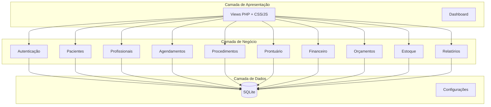
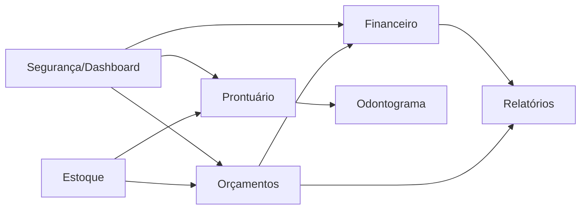

# Plano de Desenvolvimento - OdontoCare ERP

## Visão Geral da Arquitetura



## Fase 1: Fundações e Segurança (Essencial)

### 1.1 Correções de Segurança e Estrutura

**Arquivos a modificar:**
- `index.php` - Descomentar verificação de sessão
- `auth/verifica_admin.php` - Ativar em todas as páginas administrativas
- `config/conexao.php` - Adicionar backup automático

**Novos arquivos:**
- `includes/header.php` - Header padronizado com verificação de sessão
- `includes/footer.php` - Footer padronizado
- `includes/functions.php` - Funções utilitárias globais
- `.htaccess` - Proteção de diretórios

### 1.2 Dashboard Principal

**Novo módulo:** `dashboard/`

**Arquivos:**
- `dashboard/index.php` - Painel com indicadores
- `assets/css/style-dashboard.css`

**Funcionalidades:**
- Total de agendamentos do dia/semana/mês
- Pacientes novos no período
- Receitas do mês
- Gráfico de agendamentos por profissional
- Alertas de aniversariantes
- Próximos agendamentos

---

## Fase 2: Módulo Prontuário Eletrônico (Essencial)

### 2.1 Estrutura de Banco de Dados

**Novas tabelas:**
```sql
-- Anamnese (Ficha de saúde)
CREATE TABLE anamneses (
    id INTEGER PRIMARY KEY AUTOINCREMENT,
    paciente_id INTEGER NOT NULL,
    queixa_principal TEXT,
    historico_medico TEXT,
    historico_familiar TEXT,
    medicamentos TEXT,
    alergias TEXT,
    habitos TEXT,
    pressao_arterial TEXT,
    diabete INTEGER DEFAULT 0,
    problema_cardiaco INTEGER DEFAULT 0,
    gravida INTEGER DEFAULT 0,
    observacoes TEXT,
    data_cadastro DATETIME DEFAULT CURRENT_TIMESTAMP,
    FOREIGN KEY (paciente_id) REFERENCES pacientes(id)
);

-- Prontuário (Atendimentos)
CREATE TABLE prontuarios (
    id INTEGER PRIMARY KEY AUTOINCREMENT,
    paciente_id INTEGER NOT NULL,
    profissional_id INTEGER NOT NULL,
    agendamento_id INTEGER,
    data_atendimento DATE NOT NULL,
    queixa TEXT,
    diagnostico TEXT,
    procedimentos_realizados TEXT,
    prescricao TEXT,
    observacoes TEXT,
    FOREIGN KEY (paciente_id) REFERENCES pacientes(id),
    FOREIGN KEY (profissional_id) REFERENCES profissionais(id),
    FOREIGN KEY (agendamento_id) REFERENCES agendamentos(id)
);

-- Documentos do paciente
CREATE TABLE documentos_paciente (
    id INTEGER PRIMARY KEY AUTOINCREMENT,
    paciente_id INTEGER NOT NULL,
    tipo TEXT NOT NULL,
    descricao TEXT,
    arquivo_path TEXT NOT NULL,
    data_upload DATETIME DEFAULT CURRENT_TIMESTAMP,
    FOREIGN KEY (paciente_id) REFERENCES pacientes(id)
);
```

### 2.2 Estrutura de Arquivos

**Novo módulo:** `prontuario/`

**Arquivos:**
- `prontuario/index.php` - Listar atendimentos do paciente
- `prontuario/novo.php` - Novo atendimento
- `prontuario/salvar.php` - Salvar atendimento
- `prontuario/visualizar.php` - Visualizar prontuário completo
- `prontuario/anamnese.php` - Ficha de anamnese
- `prontuario/salvar_anamnese.php`

**Modificações:**
- `pacientes/listar.php` - Adicionar link "Prontuário"
- `agendamentos/agendamentos.php` - Adicionar botão "Iniciar Atendimento"

---

## Fase 3: Módulo Financeiro/Contas a Receber (Essencial)

### 3.1 Estrutura de Banco de Dados

**Novas tabelas:**
```sql
-- Contas a receber (parcelas)
CREATE TABLE contas_receber (
    id INTEGER PRIMARY KEY AUTOINCREMENT,
    paciente_id INTEGER NOT NULL,
    descricao TEXT NOT NULL,
    valor_total DECIMAL(10,2) NOT NULL,
    valor_recebido DECIMAL(10,2) DEFAULT 0,
    data_vencimento DATE NOT NULL,
    data_recebimento DATE,
    status TEXT DEFAULT 'Pendente',
    forma_pagamento TEXT,
    observacoes TEXT,
    criado_em DATETIME DEFAULT CURRENT_TIMESTAMP,
    FOREIGN KEY (paciente_id) REFERENCES pacientes(id)
);

-- Movimentação de caixa
CREATE TABLE caixa (
    id INTEGER PRIMARY KEY AUTOINCREMENT,
    tipo TEXT NOT NULL, -- 'entrada' ou 'saida'
    descricao TEXT NOT NULL,
    valor DECIMAL(10,2) NOT NULL,
    data_movimento DATE NOT NULL,
    categoria TEXT,
    forma_pagamento TEXT,
    conta_receber_id INTEGER,
    observacoes TEXT,
    usuario_id INTEGER,
    criado_em DATETIME DEFAULT CURRENT_TIMESTAMP,
    FOREIGN KEY (conta_receber_id) REFERENCES contas_receber(id),
    FOREIGN KEY (usuario_id) REFERENCES users(id)
);

-- Formas de pagamento
CREATE TABLE formas_pagamento (
    id INTEGER PRIMARY KEY AUTOINCREMENT,
    descricao TEXT NOT NULL,
    ativo INTEGER DEFAULT 1
);
```

### 3.2 Estrutura de Arquivos

**Novo módulo:** `financeiro/`

**Arquivos:**
- `financeiro/index.php` - Dashboard financeiro
- `financeiro/contas_receber.php` - Listar contas
- `financeiro/nova_conta.php` - Cadastrar nova conta
- `financeiro/receber.php` - Registrar recebimento
- `financeiro/caixa.php` - Movimentação de caixa
- `financeiro/nova_movimentacao.php`
- `financeiro/relatorio.php` - Relatório financeiro

---

## Fase 4: Módulo Orçamentos (Essencial)

### 4.1 Estrutura de Banco de Dados

**Novas tabelas:**
```sql
-- Orçamentos
CREATE TABLE orcamentos (
    id INTEGER PRIMARY KEY AUTOINCREMENT,
    paciente_id INTEGER NOT NULL,
    profissional_id INTEGER NOT NULL,
    data_orcamento DATE DEFAULT CURRENT_DATE,
    valor_total DECIMAL(10,2) NOT NULL,
    desconto DECIMAL(10,2) DEFAULT 0,
    valor_final DECIMAL(10,2) NOT NULL,
    status TEXT DEFAULT 'Pendente', -- Pendente, Aprovado, Recusado
    observacoes TEXT,
    validade_dias INTEGER DEFAULT 30,
    FOREIGN KEY (paciente_id) REFERENCES pacientes(id),
    FOREIGN KEY (profissional_id) REFERENCES profissionais(id)
);

-- Itens do orçamento
CREATE TABLE orcamento_itens (
    id INTEGER PRIMARY KEY AUTOINCREMENT,
    orcamento_id INTEGER NOT NULL,
    procedimento_id INTEGER NOT NULL,
    quantidade INTEGER DEFAULT 1,
    valor_unitario DECIMAL(10,2) NOT NULL,
    valor_total DECIMAL(10,2) NOT NULL,
    dente TEXT, -- Número do dente (ex: 18, 37)
    face TEXT, -- Faces do dente (ex: M, D, O, P, L)
    FOREIGN KEY (orcamento_id) REFERENCES orcamentos(id),
    FOREIGN KEY (procedimento_id) REFERENCES procedimentos(id)
);
```

### 4.2 Estrutura de Arquivos

**Novo módulo:** `orcamentos/`

**Arquivos:**
- `orcamentos/listar.php`
- `orcamentos/novo.php` - Criar orçamento com seleção de procedimentos
- `orcamentos/salvar.php`
- `orcamentos/visualizar.php` - Imprimir/visualizar orçamento
- `orcamentos/aprovar.php` - Aprovar orçamento (gera contas a receber)
- `assets/css/style-orcamento-print.css` - Estilo para impressão

---

## Fase 5: Módulo Odontograma (Importante)

### 5.1 Estrutura de Banco de Dados

**Nova tabela:**
```sql
-- Odontograma
CREATE TABLE odontograma (
    id INTEGER PRIMARY KEY AUTOINCREMENT,
    paciente_id INTEGER NOT NULL,
    dente INTEGER NOT NULL, -- 11 a 48 (sistema FDI)
    face TEXT, -- M, D, O, P, L
    condicao TEXT NOT NULL, -- Saudavel, Carie, Tratado, Extraido, etc
    procedimento_id INTEGER,
    cor TEXT DEFAULT '#FFFFFF',
    observacoes TEXT,
    data_registro DATE DEFAULT CURRENT_DATE,
    FOREIGN KEY (paciente_id) REFERENCES pacientes(id),
    FOREIGN KEY (procedimento_id) REFERENCES procedimentos(id)
);
```

### 5.2 Estrutura de Arquivos

**Novo módulo:** `odontograma/`

**Arquivos:**
- `odontograma/index.php` - Visualização do odontograma
- `odontograma/atualizar.php` - Registrar condição do dente
- `assets/js/odontograma.js` - Interatividade do mapa dental
- `assets/css/style-odontograma.css`

---

## Fase 6: Módulo Estoque (Importante)

### 6.1 Estrutura de Banco de Dados

**Novas tabelas:**
```sql
-- Produtos/Estoque
CREATE TABLE produtos (
    id INTEGER PRIMARY KEY AUTOINCREMENT,
    codigo TEXT UNIQUE,
    descricao TEXT NOT NULL,
    categoria TEXT,
    unidade TEXT, -- un, cx, ml, g
    quantidade_minima DECIMAL(10,2) DEFAULT 0,
    quantidade_atual DECIMAL(10,2) DEFAULT 0,
    valor_custo DECIMAL(10,2),
    valor_venda DECIMAL(10,2),
    fornecedor TEXT,
    ativo INTEGER DEFAULT 1
);

-- Movimentação de estoque
CREATE TABLE estoque_movimentacao (
    id INTEGER PRIMARY KEY AUTOINCREMENT,
    produto_id INTEGER NOT NULL,
    tipo TEXT NOT NULL, -- entrada, saida, ajuste
    quantidade DECIMAL(10,2) NOT NULL,
    motivo TEXT,
    usuario_id INTEGER,
    data_movimento DATETIME DEFAULT CURRENT_TIMESTAMP,
    FOREIGN KEY (produto_id) REFERENCES produtos(id),
    FOREIGN KEY (usuario_id) REFERENCES users(id)
);

-- Vinculo produto x procedimento
CREATE TABLE procedimento_produtos (
    id INTEGER PRIMARY KEY AUTOINCREMENT,
    procedimento_id INTEGER NOT NULL,
    produto_id INTEGER NOT NULL,
    quantidade_usada DECIMAL(10,2) DEFAULT 1,
    FOREIGN KEY (procedimento_id) REFERENCES procedimentos(id),
    FOREIGN KEY (produto_id) REFERENCES produtos(id)
);
```

### 6.2 Estrutura de Arquivos

**Novo módulo:** `estoque/`

**Arquivos:**
- `estoque/index.php` - Listar produtos
- `estoque/novo.php` - Cadastrar produto
- `estoque/entrada.php` - Registrar entrada
- `estoque/saida.php` - Registrar saída
- `estoque/alertas.php` - Produtos abaixo do mínimo

---

## Fase 7: Módulo Relatórios (Importante)

### 7.1 Estrutura de Arquivos

**Novo módulo:** `relatorios/`

**Arquivos:**
- `relatorios/index.php` - Central de relatórios
- `relatorios/agendamentos.php` - Relatório de agendamentos
- `relatorios/financeiro.php` - Relatório financeiro
- `relatorios/pacientes.php` - Relatório de pacientes
- `relatorios/procedimentos.php` - Procedimentos mais realizados
- `relatorios/profissionais.php` - Produção por profissional
- `relatorios/gerar_pdf.php` - Exportação para PDF
- `assets/js/relatorios.js` - Filtros e gráficos

---

## Fase 8: Módulo Notificações (Desejável)

### 8.1 Estrutura de Banco de Dados

**Nova tabela:**
```sql
-- Configurações de notificação
CREATE TABLE notificacoes_config (
    id INTEGER PRIMARY KEY AUTOINCREMENT,
    tipo TEXT NOT NULL, -- whatsapp, email, sms
    ativo INTEGER DEFAULT 0,
    horario_envio TEXT, -- HH:MM
    mensagem_padrao TEXT
);

-- Log de notificações enviadas
CREATE TABLE notificacoes_log (
    id INTEGER PRIMARY KEY AUTOINCREMENT,
    agendamento_id INTEGER,
    tipo TEXT NOT NULL,
    destinatario TEXT NOT NULL,
    mensagem TEXT,
    status TEXT,
    enviado_em DATETIME DEFAULT CURRENT_TIMESTAMP,
    FOREIGN KEY (agendamento_id) REFERENCES agendamentos(id)
);
```

### 8.2 Estrutura de Arquivos

**Novo módulo:** `notificacoes/`

**Arquivos:**
- `notificacoes/config.php` - Configurar lembretes
- `notificacoes/enviar.php` - Envio manual
- `cron/lembretes.php` - Script para execução automática (cron job)

---

## Fase 9: Configurações do Sistema (Essencial)

### 9.1 Estrutura de Banco de Dados

**Nova tabela:**
```sql
-- Configurações gerais
CREATE TABLE configuracoes (
    id INTEGER PRIMARY KEY AUTOINCREMENT,
    chave TEXT UNIQUE NOT NULL,
    valor TEXT,
    descricao TEXT
);

-- Dados da clínica
INSERT INTO configuracoes (chave, valor, descricao) VALUES
('clinica_nome', 'OdontoCare', 'Nome da clínica'),
('clinica_endereco', '', 'Endereço'),
('clinica_telefone', '', 'Telefone'),
('clinica_email', '', 'E-mail'),
('clinica_cnpj', '', 'CNPJ'),
('horario_inicio', '07:30', 'Horário de início dos atendimentos'),
('horario_fim', '20:00', 'Horário de fim dos atendimentos'),
('intervalo_agenda', '30', 'Intervalo entre agendamentos (minutos)');
```

### 9.2 Estrutura de Arquivos

**Novo módulo:** `configuracoes/`

**Arquivos:**
- `configuracoes/index.php` - Configurações gerais
- `configuracoes/salvar.php`
- `configuracoes/backup.php` - Backup do banco de dados

---

## Dependências entre Módulos



---

## Estrutura Final de Diretórios

```
clinica_odonto_completa/
├── index.php
├── dashboard/
│   └── index.php
├── auth/
│   ├── login.php
│   ├── logout.php
│   ├── processa_login.php
│   └── verifica_admin.php
├── config/
│   └── conexao.php
├── db/
│   ├── clinica.db
│   └── schema.sql
├── includes/
│   ├── header.php
│   ├── footer.php
│   └── functions.php
├── assets/
│   ├── css/
│   ├── js/
│   └── images/
├── pacientes/
├── profissionais/
├── procedimentos/
├── agendamentos/
├── users/
├── prontuario/
│   ├── index.php
│   ├── novo.php
│   ├── anamnese.php
│   └── visualizar.php
├── financeiro/
│   ├── index.php
│   ├── contas_receber.php
│   ├── caixa.php
│   └── relatorio.php
├── orcamentos/
│   ├── listar.php
│   ├── novo.php
│   └── visualizar.php
├── odontograma/
│   └── index.php
├── estoque/
│   ├── index.php
│   ├── entrada.php
│   └── alertas.php
├── relatorios/
│   ├── index.php
│   ├── agendamentos.php
│   └── financeiro.php
├── notificacoes/
│   └── config.php
└── configuracoes/
    ├── index.php
    └── backup.php
```

---

## Verificação/DoD (Definition of Done)

| Módulo | Critérios de Aceitação |
|--------|----------------------|
| Dashboard | Visualizar indicadores em tempo real |
| Prontuário | Registrar atendimento completo com histórico |
| Financeiro | Registrar recebimentos e gerar relatório mensal |
| Orçamentos | Criar, aprovar e converter em contas a receber |
| Odontograma | Visualizar e registrar condições dos dentes |
| Estoque | Controle de entrada/saída com alertas |
| Relatórios | Exportar dados em PDF |
| Notificações | Enviar lembretes automáticos |

---

## Próximos Passos Recomendados

1. **Implementar Fase 1** (Segurança + Dashboard) - Base para todo o sistema
2. **Implementar Fase 2** (Prontuário) - Core do sistema odontológico
3. **Implementar Fase 4** (Orçamentos) - Gera receita
4. **Implementar Fase 3** (Financeiro) - Completa o ciclo financeiro
5. Demais fases podem ser paralelizadas conforme necessidade

**Meta de Produção Sugerida:**
- Fases 1-2: Essenciais (sistema não funciona sem)
- Fases 3-4: Essenciais para operação comercial
- Fase 5: Diferencial competitivo
- Fases 6-8: Melhorias operacionais